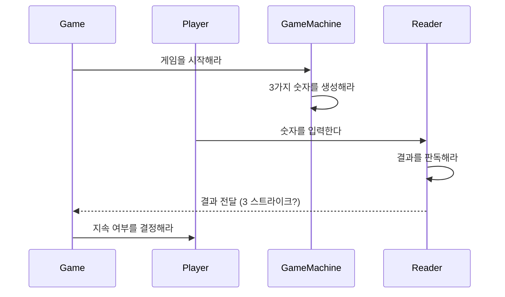

# ⚾ Object-Oriented Baseball Game

객체지향의 사실과 오해를 읽으며 구현한 숫자 야구 게임입니다. 객체들의 **책임**과 **협력** 관계에 중점을 두어 설계했습니다.

## 📖 설계 철학
객체지향의 핵심은 책임입니다. 시스템의 책임을 적절하게 분배하여 각 객체들이 자율적으로 협력하도록 설계했습니다.

### 🎯 Objects & Responsibilities

#### Game
게임의 전체적인 흐름을 관리하는 책임을 가집니다.
- 게임 시작
- 게임 지속 결정
- 게임 진행 상태 관리

#### Player
실제 게임을 진행하는 참여자로서의 책임을 가집니다.
- 숫자 3개 입력
- 게임 종료 결정

#### GameMachine
게임의 규칙을 관리하고 실행하는 책임을 가집니다.
- 3개의 랜덤 숫자 생성
- 시스템 종료 처리

#### Reader
게임의 결과를 판단하는 책임을 가집니다.
- 입력값과 정답 비교
- 스트라이크/볼 판정

### 🤝 Objects Collaboration

## 🛠 Tech Stack

## 📌 Key Features
1. **책임 주도 설계**: 각 객체가 명확한 책임을 가지고 자율적으로 행동
2. **느슨한 결합**: 객체 간 의존성을 최소화하여 유지보수성 향상
3. **높은 응집도**: 각 클래스가 하나의 책임만을 수행하도록 설계

## 🎮 How to Play
1. 프로그램 실행
2. 3자리 숫자 입력 (각 자리 숫자는 중복되지 않음)
3. 결과 확인 (스트라이크/볼)
4. 3 스트라이크가 될 때까지 반복
5. 게임 종료 여부 결정

## 💡 Learning Points
1. **책임 주도 설계**의 실제 적용
2. **객체의 자율성**을 보장하는 설계 방법
3. 객체들의 **협력 관계** 구성 방법
4. **메시지 전송**을 통한 객체 간 상호작용 구현

## 📚 Reference
- [객체지향의 사실과 오해](http://www.yes24.com/Product/Goods/18249021) by 조영호
